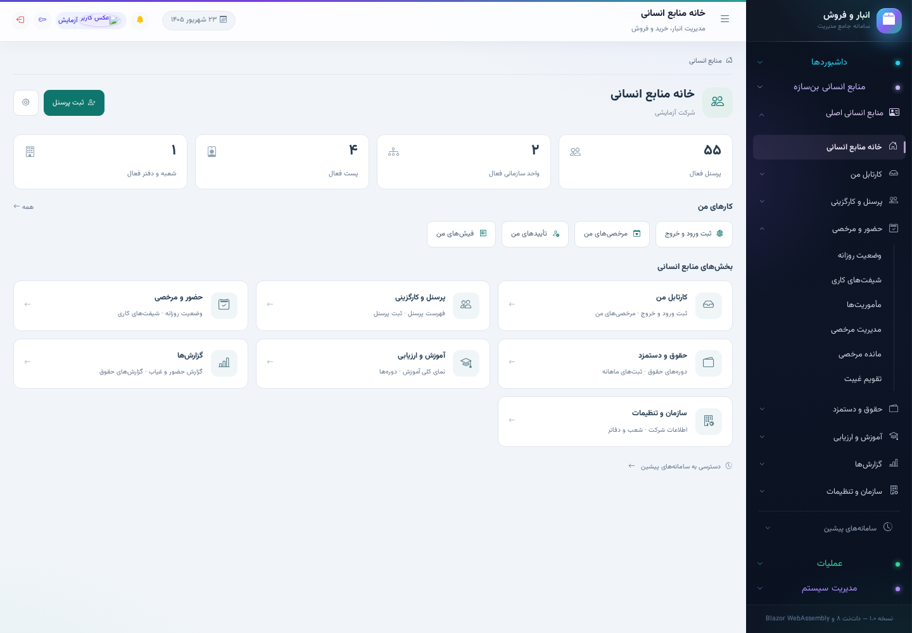
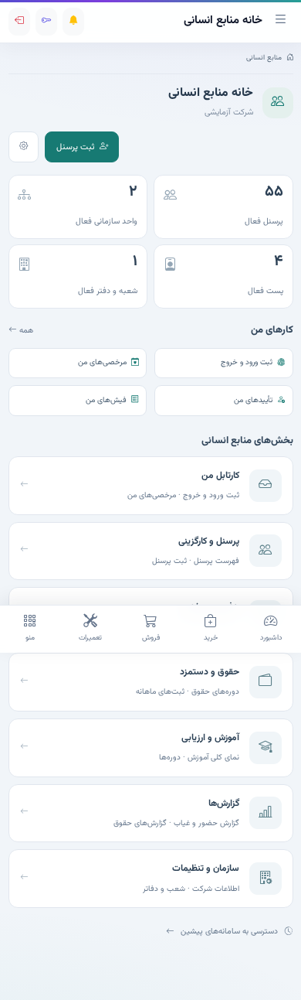
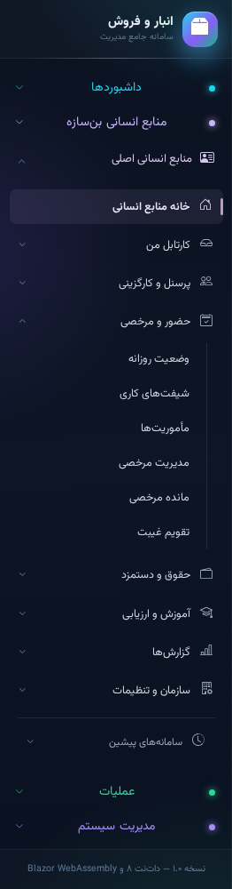

# بازطراحی منابع انسانی اصلی — گزارش اجرا

**وضعیت:** پیاده‌سازی و آزمون محلی انجام شده؛ تغییرات این مرحله هنوز commit، push یا روی سرور عملیاتی منتشر نشده‌اند.

## تغییرات انجام‌شده

- یک ورودی «منابع انسانی اصلی» و منوی جمع‌شونده بر اساس مجوزهای دقیق کاربر؛ تعریف مشترک مسیرها برای منو، خانه، صفحات بخش‌ها و مسیر راهنما.
- خانهٔ جدید با میان‌برهای شخصی، آمار واقعی سازمان، هفت بخش کاری و دسترسی جداگانه به سامانه‌های پیشین.
- راه‌اندازی اولیه فقط پس از دریافت موفق اطلاعات سازمان و برای دسترسی مرتبط؛ نبود اطلاعات با خطای دریافت یکسان نیست. تعداد کارهای معوق ساختگی اضافه نشده است.
- صفحهٔ مستقل برای هر بخش و بازنویسی مرکز تنظیمات بر اساس همان مجوزها؛ دسترسی آموزش در تنظیمات هم لحاظ شده است.
- قالب مشترک منابع انسانی: مسیر راهنما، عنوان هماهنگ، سربرگ و کنترل‌های یکدست، دکمه‌های اصلی سمت چپ و چیدمان واکنش‌گرا. متن‌های توضیحی پیش‌فرض سربرگ فرم‌های پایه حذف شده‌اند.
- مسیر پیوستهٔ فهرست پرسنل ← ثبت/ویرایش ← پرونده ← همان فهرست منابع انسانی اصلی. ورود از نمای قدیمی همچنان به همان فهرست قدیمی بازمی‌گردد.
- پس از ذخیره، کاربر دارای مجوز مشاهده به پرونده هدایت می‌شود؛ کاربر صرفاً دارای مجوز ثبت به خانه برمی‌گردد.
- فیلتر واحد سازمانی در سمت سرور، پیش از شمارش و صفحه‌بندی اعمال می‌شود؛ پارامتر جدید اختیاری است و فراخوانی‌های قدیمی معتبر می‌مانند.
- حالت خطا و تلاش مجدد برای آمار خانه، فهرست و دریافت پرونده؛ فرم ویرایش هنگام شکست دریافت، قابل ثبت نیست. در نبود دسترسی به انتخاب‌های سازمانی، مقادیر موجود حفظ و فیلدهای مربوط غیرفعال می‌شوند.

## حفاظت از بخش‌های موجود

- هر **۷۲ مقصد یکتای منوی قبلی** در دسترس باقی مانده است.
- مسیرهای قبلی حذف یا به مدل دادهٔ دیگری منتقل نشده‌اند.
- حقوق، زمان‌بندی و ارزیابی پیشین با برچسب روشن نگه داشته شده‌اند؛ هیچ محاسبهٔ مالی یا migration پایگاه داده در این مرحله تغییر نکرده است.
- منابع انسانی بن‌سازه مستقل مانده است.
- مجوزهای سمت API تغییر نکرده‌اند؛ فهرست منو صرفاً برای نمایش و مسیریابی است.

## نتیجهٔ بررسی‌ها

| بررسی | نتیجه |
|---|---|
| ساخت solution با .NET 8 | صفر خطا، ۱۲ هشدار در فایل‌های خارج از تغییرات این مرحله |
| آزمون‌های جدید منابع انسانی | ۱۹ از ۱۹ موفق |
| آزمون‌های اعلان Push | ۲۰ از ۲۰ موفق |
| آزمون‌های تکامل آرشیو | ۳۴ از ۳۴ موفق |
| آزمون‌های دستورکار | ۲۶ از ۲۶ موفق |
| مرورگر: منابع انسانی | دسکتاپ و اندازهٔ موبایل، مسیرها، نقش‌ها، ثبت و ویرایش، خطا/تلاش مجدد و حفظ مقادیر؛ موفق، بدون خطای JavaScript صفحه |
| مرورگر: اعلان و آرشیو | هر دو مجموعهٔ رگرسیون موفق |
| کنترل whitespace تغییرات | موفق |

آزمون مرورگر روی **برنامهٔ Blazor کامپایل‌شده با API و نشست آزمایشی** اجرا شده است. آزمون فیلتر سرور از SQLite استفاده می‌کند. این نتایج به‌معنی تأیید SQL Server عملیاتی، گوشی واقعی یا استقرار نیستند. مجموعهٔ کامل همهٔ ماژول‌ها اجرا نشده؛ ناسازگاری قبلاً شناخته‌شدهٔ snapshot سراسری مدل در آزمون Chat خارج از این مرحله باقی مانده است.

## تصاویر اجرای آزمایشی

داده‌ها در تصاویر آزمایشی هستند، نه اطلاعات سازمان عملیاتی.

### دسکتاپ

### اندازهٔ موبایل

## محدودهٔ ادامهٔ کار

این مرحله بازطراحی ساختار ناوبری، خانه، قالب مشترک، صفحات پایه و مسیر پرسنل است؛ بازنویسی جزئی تک‌تک فرم‌های تخصصی حقوق/آموزش/حضور انجام نشده است. ادغام مدل‌های مستقل قدیمی، انتقال داده و حذف سامانه‌های پیشین نیاز به تصمیم جداگانه دارد و انجام نشده است.

راهنمای اجرای مجدد آزمون‌ها: `tests/hr-workspace/README.md`.

## اصلاح نهایی منو: حفظ تم قبلی، فقط منابع انسانی اصلی

طبق درخواست اصلاحی کاربر، تم روشن سراسری لغو شد. `app.css` و `index.html` با نسخهٔ پیش از تغییر تم یکسان‌اند؛ سربرگ هر ۱۳ گروه غیر HR، لوگو، فوتر و رفتار نوار پایین موبایل نیز به حالت قبلی برگشته‌اند. فایل `sidebar.css` و دکمهٔ بستن سراسری اضافه‌شده حذف شدند.

تنها تغییر ظاهری منو در `HrWorkspaceNav.razor.css`، محدود به کامپوننت منابع انسانی اصلی است: متن خوانا، فاصله‌گذاری مرتب، زیرمنوهای ساده، انتخاب ملایم هم‌خانواده با تم تیره، حذف درخشش در همین شاخه و فوکوس صفحه‌کلید. مسیرها، مجوزها و فرم‌ها در این اصلاح تغییر نکرده‌اند.

بررسی این اصلاح: ساخت Client بدون خطا (۱۲ هشدار موجود) و آزمون مرورگر کامل منابع انسانی در دسکتاپ و اندازهٔ موبایل موفق بود. آزمون به‌طور مشخص باقی‌ماندن گرادیان سراسری، انیمیشن لوگوی قبلی و رنگ منوی داشبورد را در کنار محدودبودن استایل ساده به HR بررسی می‌کند. تصاویر از برنامهٔ کامپایل‌شده با دادهٔ آزمایشی‌اند؛ push یا انتشار عملیاتی انجام نشده است.

